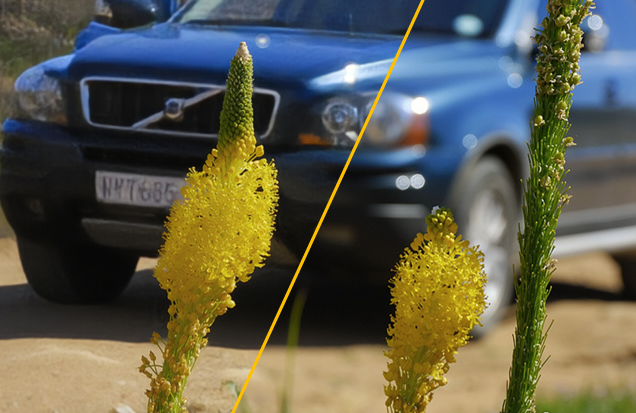

## Learning to Deblur using Light Field Generated and Real Defocused Images


[](https://colab.research.google.com/drive/1Jvfbn8HnWAmgTKFpU8fW56wXSbe1S2QI?usp=sharing)



This repository contains the official PyTorch implementation of the following paper:

> **[Learning to Deblur using Light Field Generated and Real Defocused Images](https://arxiv.org/pdf/2204.00367.pdf)**<br>
> Lingyan Ruan<sup>\*</sup>, Bin Chen<sup>\*</sup>, Jizhou Li, Miuling Lam （\* equal contribution）<br>
> IEEE Computer Vision and Pattern Recognition (**CVPR Oral**) 2022

**[PROJECT PAGE](http://lyruan.com/Projects/DRBNet/index.html)** | **[INTERACTIVE WEB APP](https://xi5tau4hrb3hsakw.anvil.app/FJJ5EACSBF63RE7RQL2K6ZDZ)**

If you find our code useful, please consider citing our paper:

```
 @inproceedings{ruan2022learning,
  title={Learning to Deblur using Light Field Generated and Real Defocus Images},
  author={Ruan, Lingyan and Chen, Bin and Li, Jizhou and Lam, Miuling},
  booktitle={Proceedings of the IEEE/CVF Conference on Computer Vision and Pattern Recognition},
  pages={16304--16313},
  year={2022}
}

```

## Code 

### Prerequisites


Notes: the code may also work with other library versions that didn't specify here.

#### 1. Installation

Clone this project to your local machine

```bash
$ git clone https://github.com/lingyanruan/DRBNet.git
$ cd DRBNet
```
#### 2. Environment setup

```bash
$ conda create -y --name DRBNet python=3.8.13 && conda activate DRBNet
$ sh install_CUDA11.1.1.sh
# Other version will be checked and updated later.
```


#### 3. Pre-trained models

Download and unzip [pretrained weights] under `./ckpts/`:
```bash
$ python download_ckpts.py 
# Weights will be placed in ./ckpts/
```


#### 4. Datasets download

```bash
$ python download_test_set.py --DPDD --RealDOF --CUHK --PixelDP 
# You may skip donwload the specific dataset by removing name, e.g., remove --PixelDP with command python download_test_set.py --DPDD --RealDOF --CUHK 
```

The original full datasets could be found here: ([LFDOF](https://sweb.cityu.edu.hk/miullam/AIFNET/), [DPDD](https://github.com/Abdullah-Abuolaim/defocus-deblurring-dual-pixel), [CUHK](http://www.cse.cuhk.edu.hk/~leojia/projects/dblurdetect/dataset.html) and [RealDOF](https://www.dropbox.com/s/arox1aixvg67fw5/RealDOF.zip?dl=1)):

#### 5. Command Line

```bash
# Single Image input
$ python run.py --net_mode single --eval_data DPDD --save_images
# eval_data could be RealDOF, CUHK, PixelDP. 


# Dual Image Input - DPDD Dataset
python run.py --net_mode dual --eval_data DPDD --save_images

```

## Performance improved on existing works - [DPDNet & KPAC]

You may go for [DPDNet](https://github.com/lingyanruan/DPDNet) and [KPAC-Net](https://github.com/lingyanruan/KPAC-Net) for their improved version. Details could be found in [Why LFDOF?] section (Table 4 & Figure 8) in the main paper. Their original version could be found [Here: DPDNet-scr](https://github.com/Abdullah-Abuolaim/defocus-deblurring-dual-pixel) and [Here: KPAC-Net-scr](https://github.com/lingyanruan/KPAC-Net)

## Relevant Resources

- TCI'20 paper: AIFNet: All-in-focus Image Restoration Network using a Light Field-based Dataset &nbsp; [[Paper](https://ieeexplore.ieee.org/document/9466450)] [[Project page](https://sweb.cityu.edu.hk/miullam/AIFNET/)] [[LFDOF Dataset](https://sweb.cityu.edu.hk/miullam/AIFNET/)] [[Code](https://github.com/binorchen/AIFNET)]

## Contact

Should you have any questions, please open an issue or contact me [lyruanruan@gmail.com](mailto:lyruanruan@gmail.com)

Acknowledgment: Some of the codes are based on the [IFAN](https://github.com/codeslake/IFAN)

## License

This software is being made available under the terms in the [LICENSE](LICENSE) file.

